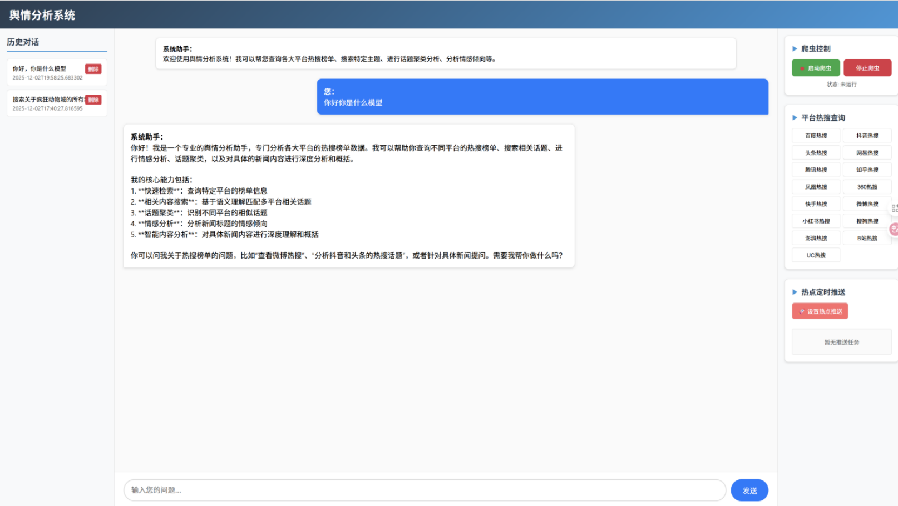
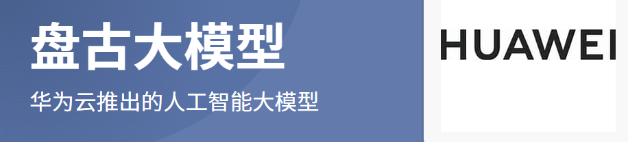

# 舆情分析助手项目文档

## 项目概述

本项目是一款结合 **15 个主流平台** 的 **26 个榜单** 实时数据与大模型分析能力的舆情分析助手。通过前端页面，用户可实现对话式热搜榜单查询、特定主题搜索、话题聚类分析及情感倾向分析。系统支持快捷键控制爬虫启停、多平台数据快速查询与跳转，并能基于新闻详情页内容（即使是视频信息也能挖掘出来）累积分析结果，设置包括邮箱、微信、企业微信、Telegram 在内的多渠道热点推送任务。

---

## 核心功能

### 1. 数据采集与分析
系统整合多平台实时数据，通过大模型分析能力提供多维舆情洞察。用户可通过自然语言对话完成以下操作：
*   **热搜榜单查询**：实时获取各平台热门话题排行。
*   **特定主题搜索**：精准定位目标舆情信息。
*   **话题聚类分析**：自动识别关联话题并生成聚类结果。
*   **情感倾向分析**：智能判断舆情正负向趋势。

### 2. 操作与推送功能
*   **爬虫控制**：支持快捷键启动/结束爬虫任务。
*   **数据查询**：各平台数据快速检索并可直接点击跳转原始页面。
*   **热点推送**：基于新闻详情页内容累积分析结果(包括视频类新闻数据的获取)，支持以下多渠道推送：
    *   企业微信群机器人
    *   企业微信应用（推送到个人微信）
    *   Telegram 机器人
    *   邮箱（SMTP 协议）

## Report - 关于人工智能与前沿科技的热点分析（推送报告示例）
**Time**: 2026-04-07 12:32:00

> 本报告旨在梳理近期人工智能与硬件生态领域的关键进展。通过对多平台数据的聚类分析，我们识别出四大核心信息流：一是大模型技术迭代与上下文能力突破，二是国产算力生态与大模型协同进展，三是全球AI商业格局重塑，四是硬件供应链对AI发展的响应调整。以下为详细报告。

---

### 🔍 核心发现与数据亮点

🔹 **大模型上下文能力迈入新阶段**：网传GPT-6提前曝光，200万超长上下文窗口引发技术社区热议，预示多模态长序列理解能力将成下一代模型竞争焦点 [[1]]

🔹 **国产算力与大模型深度协同**：DeepSeek V4确认采用华为昇腾算力底座，标志着国产芯片-框架-模型全栈生态进入规模化验证阶段 [[3]]

🔹 **中国大模型应用热度持续领先**：国内主流大模型周均调用量连续五周超越美国，反映本土场景落地与开发者生态的活跃度 [[4]]

🔹 **全球AI商业格局加速重构**：Anthropic年化收入首超OpenAI达300亿美元，企业级AI服务与垂直场景变现能力成为新增长极 [[5]]

---

### 📰 详细新闻内容梳理

> 以下列出从数据中提取的、与查询强相关的新闻条目：

#### 1️⃣ 大模型上下文能力突破：GPT-6技术细节提前曝光

**标题**：GPT-6遭提前曝光, 2M超长上下文来了

**URL**：[🎬 点击观看视频](https://www.bilibili.com/video/BV13pSoBBEvX/?spm_id_from=333.337.search-card.all.click)

**摘要**：社区流传信息显示，下一代GPT模型或支持200万token上下文窗口，将大幅提升长文档理解、多轮对话连贯性及代码项目级分析能力。尽管官方尚未确认，但该预期已推动开发者提前规划长上下文应用场景。

#### 2️⃣ 硬件供应链响应AI需求：DDR3主板因性价比重现市场

**标题**：内存太贵？厂商将复产DDR3主板

**URL**：[🎬 点击观看视频](https://www.bilibili.com/video/BV1BFDwBZEJq/?spm_id_from=333.337.search-card.all.click)

**摘要**：受全球存储芯片价格波动影响，部分嵌入式与边缘AI设备厂商重新评估硬件选型。DDR3平台凭借成熟工艺与成本优势，在推理端低功耗场景中重现需求，反映AI硬件生态的多元化适配趋势。

#### 3️⃣ 国产算力生态里程碑：DeepSeek V4拥抱华为昇腾

**标题**：DeepSeek V4采用华为算力，国产芯片生态走到哪一步了？

**URL**：[点击查看](https://www.iheima.com/article-395922.html)

**摘要**：国产大模型DeepSeek最新迭代版本确认基于华为昇腾910B集群训练，标志着国产AI芯片在大规模分布式训练场景的可用性获得头部模型厂商认可。行业观察认为，这将为"模型-芯片-框架"协同优化提供重要实践样本。

#### 4️⃣ 应用热度持续领先：中国大模型调用量五周蝉联全球第一

**标题**：中国主流大模型周调用量连续五周超越美国！

**URL**：[点击查看](https://www.toutiao.com/article/7625514106853818934/?channel=&source=search_tab)

**摘要**：第三方监测数据显示，2026年3月以来，中国头部大模型日均API调用量稳定高于美国同类产品，反映本土开发者生态、企业集成需求与C端应用创新的活跃程度。分析指出，场景驱动正成为中国大模型发展的核心优势。

#### 5️⃣ 商业格局重塑：Anthropic收入首超OpenAI

**标题**：首次超越OpenAI，Anthropic年化收入暴涨至300亿美元！

**URL**：[点击查看](https://news.sina.cn/2026-04-07/detail-inhtrumc5298053.d.html)

**摘要**：市场研究机构披露，Anthropic凭借企业级安全合规方案与垂直行业定制服务，2026财年年化收入突破300亿美元，首次超越OpenAI。该变化预示大模型竞争正从"技术参数"转向"商业落地能力"的新阶段。

---

### 📊 分析与总结

> 从以上信息可以看出，近期人工智能与前沿科技领域的消息主要呈现四个特征：

✅ **技术能力向"超长上下文"演进**  
200万token窗口预期推动长序列建模、多模态融合等方向的技术储备，开发者需提前规划应用场景与评估框架

✅ **国产生态进入"协同验证"深水区**  
大模型厂商与国产算力平台的深度绑定，标志着技术自主可控从"可用"迈向"好用"，但生态工具链与开发者体验仍是关键挑战

✅ **应用热度与商业价值双轮驱动**  
中国大模型调用量领先反映场景创新活力，而Anthropic的商业突破则提示企业级服务、垂直整合与合规能力将成为下一阶段竞争焦点

✅ **硬件生态呈现"分层适配"趋势**  
高端训练集群与边缘推理设备对硬件需求分化，促使供应链在性能、成本、功耗间寻求动态平衡

---

### 🌐 信息传播特点

| 维度 | 观察结论 |
|------|----------|
| **来源分布** | 专业科技媒体（黑马、新浪科技）与社区平台（B站、今日头条）形成有效互补 |
| **内容特征** | 技术预期类内容传播快但需验证，商业数据类内容权威性高但解读门槛较高 |
| **用户建议** | 获取信息时关注多源验证，理性区分"技术预期"与"官方确认"、"商业宣传"与"实际落地"的时间差 |

---

### 💡 综上所述

> 当前人工智能领域正处于 **"技术突破-生态协同-商业验证"** 的关键交汇期。大模型能力迭代、国产算力进展、应用热度与商业格局变化相互交织，共同推动行业从"技术竞赛"向"价值创造"务实转型。
---
# 技术选型说明：关于使用盘古大模型


## 概述

本项目在开发过程中，为提升舆情分析环节的核心能力，对多个开源及可本地化部署的大语言模型进行了对比测试。经实际验证，**华为盘古大模型**在本项目的特定任务场景下表现良好，因此选择将其作为推荐的分析引擎之一集成到项目中。

## 选型理由

以下是在本地测试环境中，我们观察到的盘古模型相较于其他对比模型的一些**实际特点**：

1.  **对长文本的解析能力较强**
    *   在处理新闻稿、长篇论坛帖子等文本时，能较为稳定地提取核心事件与观点。
    *   在情感倾向分析上，对中文的复杂性（如反讽、隐晦表述）有相对更好的处理能力。

2.  **领域知识适配性较好**
    *   在涉及科技、金融、公共政策等领域的文本分析中，表现出更准确的术语理解和上下文关联。

3.  **本地部署的可行性**
    *   支持本地化部署，这对于处理敏感的舆情数据、保障数据隐私和满足定制化需求至关重要。
    *   在本地环境运行，避免了因网络API调用带来的延迟、费用与稳定性问题。

## 资源参考

如果您对盘古模型感兴趣，可以参考以下官方资源进行深入了解：
*   华为openPangu-Embedded-7B-model下载地址：https://ai.gitcode.com/ascend-tribe/openpangu-embedded-7b-model

---

## 项目结构

### 主要文件夹
*   **分析系统**：`hotsearch_analysis_agent`
*   **爬虫集群**：`hotsearchcrawler`（与分析系统完全分离）

### 核心文件说明
*   **项目启动文件**：`app.py`
*   **推送任务测试文件**：`test_push_task`
*   **爬虫测试文件**：`runspider-test`
*   **爬虫启动文件**：`run_spiders`（通过前端界面启动）
*   **数据库初始化参考**：`init.py`

---

## 部署步骤

### 1. 环境准备

#### 1.1 浏览器驱动配置（详细步骤）
本项目依赖浏览器驱动获取新闻详情页内容，需按以下步骤配置：

**步骤一：确认浏览器版本**
- 确保已安装 **Edge** 或 **Chrome/Chromium** 浏览器。
- 打开浏览器，进入 `设置` → `关于`，查看浏览器版本号（如 `Chrome 115.0.5790.102`）。

**步骤二：下载对应驱动**
- **Chrome 驱动**：访问 [ChromeDriver 下载页](https://chromedriver.chromium.org/)
- **Edge 驱动**：访问 [EdgeDriver 下载页](https://developer.microsoft.com/en-us/microsoft-edge/tools/webdriver/)
- 选择与浏览器版本匹配的驱动版本，下载对应操作系统的驱动文件（如 `chromedriver.exe`（Windows）、`chromedriver`（macOS/Linux））。

**步骤三：定位浏览器安装路径**
- **Windows**：通常位于 `C:\Program Files\Google\Chrome\Application\` 或 `C:\Program Files (x86)\Microsoft\Edge\Application\`
- **macOS**：通常位于 `/Applications/Google Chrome.app/Contents/MacOS/` 或 `/Applications/Microsoft Edge.app/Contents/MacOS/`
- **Linux**：通常位于 `/usr/bin/google-chrome` 或 `/usr/bin/microsoft-edge`

**步骤四：将驱动文件放置于系统可识别路径**
- 建议将驱动文件（如 `chromedriver`）放置在以下任一位置：
    1. 浏览器的安装目录（与浏览器可执行文件同级）
    2. 系统 `PATH` 环境变量中包含的任意目录（如 `/usr/local/bin/`（macOS/Linux）或 `C:\Windows\System32\`（Windows））

**步骤五：添加驱动路径至系统 PATH**
- **Windows**：
    1. 右键"此电脑" → "属性" → "高级系统设置" → "环境变量"
    2. 在"系统变量"中找到 `Path`，点击"编辑"
    3. 添加驱动所在目录的完整路径（如 `C:\WebDriver\`）
- **macOS/Linux**：
    1. 打开终端，编辑 `~/.bashrc` 或 `~/.zshrc`
    2. 添加一行：`export PATH=$PATH:/path/to/driver/directory`
    3. 执行 `source ~/.bashrc` 或重启终端

**步骤六：验证驱动是否可用**
- 在终端或命令行中执行：
  ```bash
  chromedriver --version
  ```
  或
  ```bash
  msedgedriver --version
  ```
- 若显示版本号，则说明驱动配置成功。

#### 1.2 虚拟环境与依赖安装
- 创建并激活虚拟环境。
- 执行命令安装依赖：`pip install -r requirements.txt`

#### 1.3 数据库配置
- 下载安装 MySQL 数据库。
- 参考 `init.py` 代码建立相应库和数据表。

---

### 2. 参数配置

#### 2.1 爬虫集群配置 (`hotsearchcrawler/settings`)
- MySQL 接口参数设置。
- 个别平台 cookies（可选）。

#### 2.2 分析系统配置
- **`.env` 文件设置**
    - MySQL 参数。
    - OpenAI 格式大模型接口参数。
    - 各平台推送参数。
    - 历史记忆轮数、模型温度等参数。
- **cookies 配置**
    - 在 `config/cookies` 文件中设置相应格式的平台 cookies（可通过浏览器插件获取）。
    - **注**：cookies 为可选项，若未配置将损失个别平台的详情页提取能力。

---

## 推送任务参数获取指南（建议优先考虑邮箱推送，简单易使用）

### 1. 企业微信群机器人（群聊）
**参数名**: `WECOM_WEBHOOK`
**获取步骤**：
1.  登录企业微信管理后台（work.weixin.qq.com）。
2.  进入"应用管理" → "创建应用"或选择已有应用。
3.  在应用详情中，找到"接收消息" → "配置 API 接收"。

**简易方式**：
1.  在任意群聊中点击右上角群设置。
2.  选择"添加机器人" → "新建机器人"。
3.  设置机器人名称，复制生成的 Webhook URL。

**格式示例**：
`https://qyapi.weixin.qq.com/cgi-bin/webhook/send?key=xxxxxxxx-xxxx-xxxx-xxxx-xxxxxxxxxxxx`

### 2. 企业微信应用（推送到个人微信）
需配置四个参数：

*   **企业 ID (`WECOM_CORP_ID`)**：
    *   **获取方式**：登录企业微信后台 → "我的企业" → "企业信息" → 找到"企业 ID"（通常以 `ww` 开头）。

*   **应用 ID (`WECOM_AGENT_ID`)**：
    *   **获取方式**：进入"应用管理" → 选择或创建应用 → 在应用详情页找到"AgentId"。

*   **应用密钥 (`WECOM_SECRET`)**：
    *   **获取方式**：在应用详情页找到"Secret"字段 → 点击"查看"（可能需要管理员权限）→ 复制生成的 Secret（一串随机字符）。

*   **接收用户 ID (`WECOM_USER_ID`)**：
    *   **获取方式**：进入"通讯录" → 查看成员信息 → 成员的"账号"字段即为 UserID。
    *   **注意**：多个用户用 `|` 分隔，如：`zhangsan|lisi|wangwu`。

### 3. Telegram 机器人
需配置两个参数：

*   **机器人 Token (`TELEGRAM_BOT_TOKEN`)**：
    *   **获取步骤**：
        1.  在 Telegram 中搜索 `@BotFather`。
        2.  发送 `/newbot` 命令。
        3.  按提示设置机器人名称和 username。
        4.  BotFather 会返回 token。
    *   **格式示例**：`1234567890:ABCDEFGHIJKLMNOPQRSTUVWXYZ`

*   **聊天 ID (`TELEGRAM_CHAT_ID`)**：
    *   **获取方法一（个人聊天）**：
        1.  给机器人发送任意消息。
        2.  访问：`https://api.telegram.org/bot<YourBOTToken>/getUpdates`
        3.  在返回的 JSON 中找到 `chat.id`。
    *   **获取方法二（群组/频道）**：
        1.  将机器人添加到群组/频道。
        2.  在群组中发送一条消息。
        3.  通过上述 `getUpdates` 接口获取 `chat.id`。
    *   **注意**：群组 ID 为负数，个人聊天 ID 为正数。

### 4. 邮箱推送（SMTP）
需配置五个参数：

*   **SMTP 服务器 (`EMAIL_HOST`)**：
    *   **常用邮箱 SMTP 服务器**：
        *   QQ 邮箱：`smtp.qq.com`
        *   163 邮箱：`smtp.163.com`
        *   Gmail：`smtp.gmail.com`
        *   企业邮箱：咨询邮箱服务商。

*   **端口号 (`EMAIL_PORT`)**：
    *   **常见端口**：
        *   SSL 加密：`465`
        *   TLS 加密：`587`
        *   非加密：`25`（不推荐）。

*   **发件邮箱 (`EMAIL_USER`)**：
    *   用于发送邮件的邮箱地址，示例：`your_email@qq.com`。

*   **邮箱密码/授权码 (`EMAIL_PASSWORD`)**：
    *   **注意**：不是登录密码，而是 SMTP 授权码。
    *   **获取方式**：
        *   QQ 邮箱：设置 → 账户 → POP3/IMAP 服务 → 生成授权码。
        *   163 邮箱：设置 → POP3/SMTP/IMAP → 客户端授权密码。
        *   Gmail：需要开启两步验证，然后生成应用专用密码。

*   **收件邮箱 (`EMAIL_TO`)**：
    *   接收推送邮件的地址，多个邮箱用逗号分隔，如：`user1@qq.com,user2@163.com`。

---

## 注意事项

1.  **系统分离**：爬虫集群 (`hotsearchcrawler`) 与分析系统 (`hotsearch_analysis_agent`) 完全分离，需**分别**进行参数配置。
2.  **Cookies (可选)**：`cookies` 设置为可选项，若未配置将损失个别平台的详情页提取能力。
3.  **参数格式**：各平台推送参数需严格按照格式要求填写，否则可能导致推送失败。
4.  **数据库**：数据库配置需参考 `init.py` 代码创建相应库和表结构。
5.  **功能测试**：所有参数配置完成后，建议先运行测试文件验证功能是否正常：
    *   **推送测试**：运行 `test_push_task`。
    *   **爬虫测试**：运行 `runspider-test`。

---

## 浏览器驱动配置快速检查清单

- [ ] 已确认浏览器版本
- [ ] 已下载匹配版本的驱动
- [ ] 已配置系统 PATH（如需要）
- [ ] 已通过命令行验证驱动可用

---

**文档版本：1.1**

注意：完成浏览器驱动配置后，请继续按照项目部署文档完成后续步骤。如遇问题，可查看项目日志或运行测试文件定位具体错误。
> 💖 **小小的星星，大大的鼓励！**
> 
> 如果您觉得这个项目有用，请给它一颗星 ⭐️
> 这将激励我继续改进和完善！🚀

# 开源软件使用声明

## 项目信息
- 项目名称: 舆情分析系统
- 版本: 1.0.0
- 版权所有: [huangmingqi]
- 项目许可证: MIT

## 使用的开源软件列表

| 序号 | 开源软件名称 | 版本 | 许可证 | 用途 |
|------|--------------|------|--------|------|
| 1 | LangChain | 0.0.346 | MIT | 智能体框架构建 |
| 2 | Scrapy | 2.11.0 | BSD | 网络爬虫功能 |
| 3 | PyMySQL | 1.1.0 | MIT | MySQL数据库连接 |
| 4 | scikit-learn | 1.3.0 | BSD | 聚类分析算法 |
| 5 | jieba | 0.42.1 | MIT | 中文分词处理 |
| 6 | textblob | 0.17.1 | MIT | 情感分析功能 |
| 7 | ChromaDB | 0.4.15 | Apache 2.0 | 向量数据库 |
| 8 | sentence-transformers | 2.2.2 | Apache 2.0 | 文本嵌入模型 |
| 9 | requests | 2.31.0 | Apache 2.0 | HTTP请求处理 |
| 10 | beautifulsoup4 | 4.12.2 | MIT | HTML内容解析 |
| 11 | lxml | 4.9.3 | BSD | XML/HTML处理 |
| 12 | schedule | 1.2.0 | MIT | 定时任务调度 |
| 13 | tqdm | 4.66.1 | MPL-2.0 | 进度条显示 |
| 14 | numpy | 1.24.3 | BSD | 数值计算 |
| 15 | Twisted | 22.10.0 | MIT | 异步网络框架 |
| 16 | pyOpenSSL | 23.2.0 | Apache 2.0 | SSL/TLS支持 |
| 17 | cryptography | 41.0.7 | Apache 2.0/BSD | 加密功能 |

## 许可证义务履行

### 已履行的义务
1. 在所有分发版本中包含完整的许可证文本
2. 保留所有开源软件的版权声明
3. 在NOTICE文件中明确声明使用的开源软件
4. 提供本使用声明文档

### 许可证兼容性说明
本项目使用的开源软件均采用宽松的开源许可证（MIT、BSD、Apache 2.0等），
这些许可证与项目选择的MIT许可证完全兼容。

## 第三方服务声明
本软件使用了OpenAI API服务，该服务不属于开源软件，但受OpenAI的服务条款约束。

# 免责声明

## 重要提示

本项目（包括但不限于所有爬虫代码、分析工具及相关文档）仅供**学习、研究与交流目的**使用。任何用户在使用本项目代码或衍生作品前，**必须**仔细阅读并理解本免责声明的全部内容。使用本项目即表示您同意承担所有相关风险及责任。

## 1. 使用性质
- 本项目为**技术演示与学术研究项目**，所有代码及文档均不构成任何形式的专业建议或服务。
- 严禁将本项目用于任何**非法、侵权、商业盈利或违反目标网站服务条款**的用途。

## 2. 关于网络爬虫的特别声明
- **遵守法律法规与网站协议**：使用者有责任确保其爬虫行为符合《中华人民共和国网络安全法》、《数据安全法》、《个人信息保护法》等相关法律法规，并严格遵守目标网站的`robots.txt`协议、服务条款及使用规范。
- **尊重网站负载**：使用者应通过合理技术手段（如设置请求间隔、并发控制等）避免对目标网站服务器造成不当负担或干扰其正常运营。
- **数据使用限制**：通过爬虫获取的任何数据，其使用范围不得超出数据所有者（目标网站）明确允许的范畴，并应特别注意对个人信息、商业秘密等敏感数据的保护。

## 3. 风险自担
- 使用本项目代码及由此产生的任何行为**完全由使用者自行承担风险**。项目开发者（贡献者）不对以下情况负责：
    - 因使用本项目而产生的任何直接、间接、偶然或特殊的损失或损害。
    - 因违反目标网站规定、相关法律或本声明所引发的任何法律纠纷、索赔或处罚。
    - 因数据准确性、完整性、及时性问题导致的任何决策后果。

## 4. 知识产权
- 项目代码版权归本仓库贡献者所有，详见LICENSE文件。
- 通过爬虫获取的数据，其知识产权归属于原始数据提供方（目标网站/平台）。使用者有责任尊重并维护原始数据所有者的合法权益。

## 5. 第三方责任
- 本项目可能引用或依赖第三方库、工具或服务，其各自的知识产权与免责声明由其所有者提供。项目开发者不对这些第三方内容承担任何责任。

## 6. 建议与终止
- **强烈建议**在使用任何爬虫前，先行咨询法律与合规专业人士，并与目标网站进行必要沟通。
- 如任何网站明确要求停止抓取，使用者应立即终止相关爬虫行为。
- 项目开发者保留随时更新或终止本项目的权利，且不因此对任何使用者承担责任。

---
